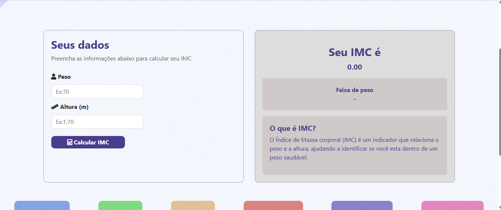

**Calculadora de IMC**

Projeto front-end desenvolvido para calcular o Índice de Massa Corporal (IMC) a partir do peso e da altura informados pelo usuário.

**Tecnologias**

HTML

CSS

TypeScript

**Funcionalidades**

Entrada de peso e altura.

Cálculo automático do IMC.

Exibição do resultado de acordo com o valor calculado.

Interface simples e responsiva.

Como executar
Clone o repositório:

git clone https://github.com/RafaelaDesousa33/projeto_calculadora_imc.git

Acesse a pasta do projeto e abra o arquivo index.html no navegador.

Objetivo
Projeto desenvolvido para praticar conceitos básicos de desenvolvimento front-end, manipulação de dados e lógica de programação com TypeScript.
